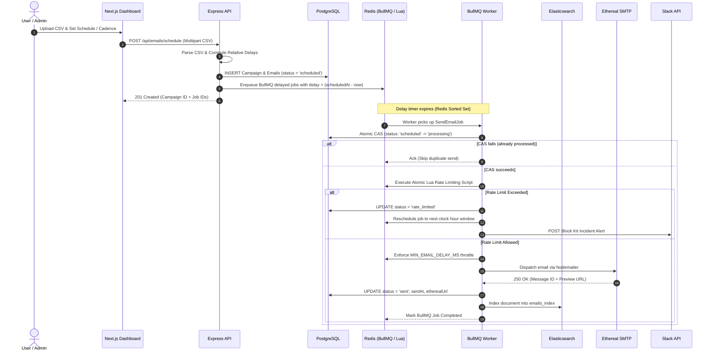

# AutoMail - Production-Grade Distributed Email Job Scheduler

A high-performance, fault-tolerant, and distributed email outreach job scheduler built with **Next.js 14**, **Express.js (TypeScript)**, **PostgreSQL (Prisma ORM)**, **Redis (BullMQ)**, **Elasticsearch 8.11**, **Nodemailer (Ethereal SMTP)**, and **Slack OAuth 2.0**.

---

## 📑 Table of Contents

1. [Executive Summary & System Highlights](#-executive-summary--system-highlights)
2. [Distributed System Architecture](#-distributed-system-architecture)
3. [Zero-Cron Scheduling Architecture](#-zero-cron-scheduling-architecture)
4. [Distributed Atomic Rate Limiting (Redis Lua)](#-distributed-atomic-rate-limiting-redis-lua)
5. [Atomic CAS Idempotency & Crash Recovery](#-atomic-cas-idempotency--crash-recovery)
6. [Inter-Send Delay Throttling](#-inter-send-delay-throttling)
7. [Elasticsearch 8.11 Full-Text Search](#-elasticsearch-811-full-text-search)
8. [Slack OAuth 2.0 Incident Alerting](#-slack-oauth-20-incident-alerting)
9. [Bull Board Queue Observability](#-bull-board-queue-observability)
10. [Technology Stack](#-technology-stack)
11. [Repository Structure](#-repository-structure)
12. [Step-by-Step Getting Started](#-step-by-step-getting-started)
13. [Comprehensive REST API Reference](#-comprehensive-rest-api-reference)
14. [Automated Verification & Master Test Suite](#-automated-verification--master-test-suite)
15. [Distributed System Trade-Offs & Production Hardening](#-distributed-system-trade-offs--production-hardening)
16. [Phase Completion Matrix](#-phase-completion-matrix)

---

## 🌟 Executive Summary & System Highlights

AutoMail is engineered to eliminate the systemic flaws of traditional email dispatch systems (e.g., cron-based polling, clock drift, double-send race conditions, unthrottled worker bursts, and silent failures).

```
 ┌─────────────────────────────────────────────────────────────────────────────┐
 │                         CORE SYSTEM CAPABILITIES                            │
 ├─────────────────────────────────────────────────────────────────────────────┤
 │  🚫 ZERO-CRON ARCHITECTURE    BullMQ delayed jobs in Redis (O(log N) zset)  │
 │  🔒 ATOMIC CAS IDEMPOTENCY    Zero duplicate sends under concurrent workers │
 │  ⚡ ATOMIC RATE LIMITING      Redis Lua script enforcement across nodes     │
 │  ⏱️ MIN DELAY THROTTLING      Per-sender inter-email cadence spacing        │
 │  🔍 FULL-TEXT SEARCH          Elasticsearch 8.11 multi-match with boosting  │
 │  🔔 SLACK INCIDENT BRIDGE     Real OAuth 2.0 alerting for rate limit events │
 │  📊 QUEUE OBSERVABILITY       Live Bull Board UI for queue telemetry        │
 │  🧪 MASTER TEST SUITE         Automated end-to-end multi-worker test runner │
 └─────────────────────────────────────────────────────────────────────────────┘
```

---

## 🏗️ Distributed System Architecture

The system is decoupled into an event-driven, horizontally scalable microservice architecture:

```
                            +-----------------------------------+
                            |         Next.js 14 Web UI         |
                            |   (App Router + Tailwind CSS)     |
                            +-----------------+-----------------+
                                              |
                                              | REST API (JWT)
                                              v
                            +-----------------------------------+
                            |        Express.js Backend         |
                            |     (TypeScript, Zod, Helmet)     |
                            +--------+----------------+---------+
                                     |                |
             PostgreSQL 16 (Prisma)  |                | Delayed Job Enqueue
             Source of Truth         v                v
                 +-----------------------+    +-----------------------+
                 |      PostgreSQL       |    |         Redis         |
                 |  - Users & Senders    |    |  - BullMQ Delayed ZSET|
                 |  - Campaigns & Emails |    |  - Atomic Lua Limiter |
                 |  - Slack OAuth Tokens |    |  - Throttle Timestamps|
                 +-----------+-----------+    +-----------+-----------+
                             |                            |
                 Dual-Write  | Sync                       | Worker Dequeue
                             v                            v
                 +-----------------------+    +-----------------------+
                 |  Elasticsearch 8.11   |    |  BullMQ Worker Pool   |
                 | - Multi-Match Index   |    |  (CAS Protected Node) |
                 | - Field Boosting      |    +-----------+-----------+
                 | - Typo-tolerant Search|                |
                 +-----------------------+                | SMTP Dispatch
                                                          v
                                              +-----------------------+
                                              | Nodemailer + Ethereal |
                                              | Live Mail Delivery &  |
                                              | Web Preview Artifacts |
                                              +-----------------------+
```

### End-to-End Execution Sequence Flow



---

## 🚫 Zero-Cron Scheduling Architecture

### Why Traditional Cron / Polling Schedulers Fail in Distributed Systems:
1. **Clock Drift & Race Conditions**: Multiple instances running `node-cron` or OS cron will poll the database simultaneously, leading to redundant queries and duplicate execution windows unless distributed locks are maintained with high overhead.
2. **Database Polling Tax**: Periodic `SELECT * FROM emails WHERE status = 'scheduled' AND scheduled_at <= NOW()` puts continuous indexing and I/O pressure on the database, scaling poorly as tables grow to millions of rows.
3. **Imprecise Millisecond Granularity**: Cron expressions only evaluate at 1-minute resolutions. Sub-minute cadence spacing (e.g., 2000ms inter-send delay) cannot be represented natively by cron.

### The BullMQ Delayed Queue Solution:
- **Redis Sorted Sets (`zset`)**: When an email is scheduled for $T_{scheduled}$, BullMQ calculates $\Delta = T_{scheduled} - T_{now}$ and inserts the job into Redis with score = $T_{scheduled}$ (epoch millisecond timestamp).
- **O(log N) Time Complexity**: Redis manages timer expiration natively via internal event loops and sorted set score queries (`ZRANGEBYSCORE`). Zero polling queries touch PostgreSQL during the waiting period.
- **Dynamic Calculation**: When uploading campaigns with $N$ recipients, delays are staggered dynamically across time windows:
  $$\text{delay}_i = \max(0, \text{campaignStartTime} - \text{now}) + (i \times \text{MIN\_EMAIL\_DELAY\_MS})$$

---

## ⚡ Distributed Atomic Rate Limiting (Redis Lua)

To prevent breaking provider hourly sending quotas across dozens of worker nodes, rate limits are checked atomically using a Redis Lua script.

### Atomic Lua Script

```lua
local key = KEYS[1]
local max_limit = tonumber(ARGV[1])
local ttl_seconds = tonumber(ARGV[2])

local current = tonumber(redis.call('get', key) or "0")

if current < max_limit then
    current = redis.call('incr', key)
    if current == 1 then
        redis.call('expire', key, ttl_seconds)
    end
    return {1, current} -- Allowed (1 = true)
else
    return {0, current} -- Exceeded (0 = false)
end
```

### Automatic Rescheduling Window Calculation
When a sender breaches their limit (e.g., 100 emails/hour):
1. The job is **not dropped** or moved to failed status.
2. The system computes the millisecond offset to the next clock hour:
   $$\text{nextHourMs} = (\text{currentHour} + 1)\text{ epoch ms} - \text{now()}$$
3. The email state is updated in PostgreSQL to `rate_limited`.
4. BullMQ re-enqueues the job with `delay = nextHourMs + jitter`.
5. An automated Slack incident alert is dispatched to notifying the operations team.

---

## 🔒 Atomic CAS Idempotency & Crash Recovery

To ensure strict zero-duplicate delivery even under network partitioning, worker crashes, or node restarts:

```
                            Worker attempts job
                                    │
                                    ▼
                ┌───────────────────────────────────────┐
                │  Query DB: Check current email state  │
                └───────────────────┬───────────────────┘
                                    │
                    ┌───────────────┴───────────────┐
                    ▼                               ▼
            Status == 'sent'               Status == 'scheduled'
                    │                               │
                    ▼                               ▼
       ┌────────────────────────┐      ┌─────────────────────────┐
       │ Return early:          │      │ Execute Atomic CAS:     │
       │ "already_sent_skip"    │      │ UPDATE status='processing'
       └────────────────────────┘      │ WHERE id=:id AND        │
                                       │ status IN ('scheduled', │
                                       │            'rate_limit')│
                                       └────────────┬────────────┘
                                                    │
                                    ┌───────────────┴───────────────┐
                                    ▼                               ▼
                            Rows affected == 0             Rows affected == 1
                                    │                               │
                                    ▼                               ▼
                      ┌───────────────────────────┐    ┌─────────────────────────┐
                      │ Lock lost to rival worker │    │ Lock acquired!          │
                      │ Abort execution cleanly   │    │ Safe to deliver email   │
                      └───────────────────────────┘    └─────────────────────────┘
```

```typescript
// Atomic Compare-And-Swap Query in backend/src/utils/idempotency.ts
const result = await prisma.$executeRaw`
  UPDATE emails 
  SET status = 'processing', attempts = attempts + 1, updated_at = NOW()
  WHERE id = ${emailId} AND status IN ('scheduled', 'rate_limited')
`;
```

---

## ⏱️ Inter-Send Delay Throttling

To comply with SMTP spam filters and maintain email sender reputation:
- Senders have a configurable minimum inter-email delay (`MIN_EMAIL_DELAY_MS`, default `2000ms`).
- Before dispatching an email, the worker checks the Redis key `email-last-send:{senderId}`:
  $$\text{elapsed} = \text{Date.now}() - \text{lastSentTimestamp}$$
  $$\text{sleepMs} = \max(0, \text{MIN\_EMAIL\_DELAY\_MS} - \text{elapsed})$$
- The worker executes an asynchronous non-blocking delay before initiating the SMTP handshake, updating the Redis timestamp immediately upon transmission.

---

## 🔍 Elasticsearch 8.11 Full-Text Search

Elasticsearch indexes all email metadata asynchronously upon job completion:

- **Index Schema**: `emails_index` with fields for `id`, `campaignId`, `senderId`, `recipient`, `subject`, `body`, `status`, and timestamps.
- **Multi-Match Search Query**:
  ```json
  {
    "query": {
      "multi_match": {
        "query": "search query text",
        "fields": ["recipient^3", "subject^2", "body"],
        "fuzziness": "AUTO",
        "prefix_length": 2
      }
    }
  }
  ```
- **Field Boosting**: Matches on recipient email addresses are boosted $3\times$; matches in subjects are boosted $2\times$.

---

## 🔔 Slack OAuth 2.0 Incident Alerting

AutoMail integrates with Slack to alert teams about scheduling incidents:

- **OAuth 2.0 Flow**: Admins connect their workspace via `GET /api/slack/auth` and `GET /api/slack/callback`.
- **Incident Dispatch**: When a sender hits their rate limit or encounters severe SMTP failures, rich Block Kit alerts are posted:
  ```
  🚨 SENDER HOURLY RATE LIMIT EXCEEDED
  Sender: outreach@company.com (ID: clu89...)
  Current Usage: 100 / 100 emails
  Action Taken: 25 remaining emails rescheduled to next clock hour (14:00 UTC)
  Status: Rate Limited & Rescheduled
  ```

---

## 📊 Bull Board Queue Observability

Bull Board provides a real-time administrative interface for queue health:
- **Location**: `http://localhost:5000/admin/queues`
- **Capabilities**:
  - Live inspection of `waiting`, `active`, `delayed`, `completed`, and `failed` job states.
  - Viewing job payloads, stack traces, and attempt counts.
  - Manual retry of failed jobs and bulk queue pause/resume operations.

---

## 🛠️ Technology Stack

| Component | Technology | Version | Purpose |
|---|---|---|---|
| **Frontend UI** | Next.js (App Router) | 14.1.0 | Dashboard, Email Composer, CSV Uploader |
| **Styling** | Tailwind CSS | 3.4.1 | Glassmorphic Dark UI & Data Tables |
| **Backend Framework**| Express.js | 4.18.3 | REST API & Background Worker Host |
| **Language** | TypeScript | 5.3.3 | End-to-end strict typing |
| **Database** | PostgreSQL | 16.0 | ACID Transactional Source of Truth |
| **ORM** | Prisma ORM | 5.10.0 | Type-safe migrations and schema |
| **Queue Engine** | Redis & BullMQ | 7.2 / 5.4 | Persistent delayed jobs & rate limiter |
| **Search Engine** | Elasticsearch | 8.11.0 | Full-text fuzzy search across emails |
| **Email Transport** | Nodemailer | 6.9.10 | SMTP delivery with Ethereal previews |
| **Queue UI** | Bull Board | 9.10.1 | Operational queue monitoring dashboard |
| **Authentication** | JWT & Google OAuth | - | Secure session and user authorization |
| **Incident Alerts** | Slack OAuth 2.0 | - | Automated webhook incident dispatch |

---

## 📁 Repository Structure

```
email-scheduler/
├── docker-compose.yml              # PostgreSQL, Redis & Elasticsearch configuration
├── package.json                    # Root scripts & workspaces
├── README.md                       # Complete distributed system documentation
│
├── backend/                        # Express.js REST API & Queue Worker
│   ├── prisma/
│   │   ├── schema.prisma           # Prisma schema (User, Campaign, Sender, Email, SlackConnection)
│   │   └── seed.ts                 # Database seeder (Demo user, sender credentials, sample data)
│   ├── src/
│   │   ├── config/                 # Redis, Postgres, Elasticsearch, Bull Board configs
│   │   ├── controllers/            # Express controllers (auth, email, campaign, slack)
│   │   ├── middleware/             # Auth, error handling, Zod validation
│   │   ├── queue/                  # BullMQ email queue and worker definitions
│   │   ├── routes/                 # Express API routes
│   │   ├── services/               # Business logic (SMTP, rate limiter, scheduler, search, slack)
│   │   ├── scripts/                # Automated verification and test scripts
│   │   │   ├── runAllTests.ts      # Master automated test suite (6 tests)
│   │   │   ├── testConcurrencyDelay.ts # Worker concurrency & throttling test
│   │   │   ├── testIdempotency.ts  # Atomic CAS duplicate prevention test
│   │   │   ├── testQueue.ts        # BullMQ delayed job test
│   │   │   └── testRateLimiting.ts # Atomic Redis Lua hourly limiter test
│   │   ├── types/                  # TypeScript queue and service interfaces
│   │   ├── utils/                  # CSV parser, idempotency hasher, structured logger
│   │   ├── app.ts                  # Express application configuration
│   │   └── server.ts               # HTTP bootstrap & graceful shutdown hooks
│   ├── package.json
│   └── tsconfig.json
│
└── frontend/                       # Next.js 14 Web Application
    ├── src/
    │   ├── app/
    │   │   ├── dashboard/page.tsx  # Interactive scheduler & analytics dashboard
    │   │   ├── login/page.tsx      # Authentication & Google login page
    │   │   ├── layout.tsx          # Root layout & theme providers
    │   │   └── globals.css         # Custom animations & glassmorphism styles
    │   ├── components/             # Reusable UI components (Stats, Composer, Tables, Modals)
    │   ├── lib/                    # Client utilities & Tailwind merge
    │   ├── services/               # API clients (auth, email, campaign, slack)
    │   └── types/                  # Frontend TypeScript interfaces
    ├── package.json
    └── tailwind.config.js
```

---

## 🚀 Step-by-Step Getting Started

### 1. Prerequisites
- **Node.js**: v20.x or v22.x
- **Docker Desktop** (or Docker Engine + Docker Compose)
- **Git**

### 2. Clone and Install Dependencies
```bash
git clone https://github.com/your-username/email-scheduler.git
cd email-scheduler

# Install backend dependencies
cd backend && npm install

# Install frontend dependencies
cd ../frontend && npm install
cd ..
```

### 3. Launch Docker Infrastructure
```bash
docker compose up -d
```

Verify running containers:
```bash
docker compose ps
```
| Service | Container Port | Host Port | Status |
|---|---|---|---|
| `postgres` | 5432 | 5432 | Up (Healthy) |
| `redis` | 6379 | 6379 | Up (Healthy) |
| `elasticsearch` | 9200 | 9200 | Up (Healthy) |

### 4. Initialize Database & Seed
```bash
cd backend
npx prisma generate
npx prisma migrate dev --name init
npx prisma db seed
```

### 5. Start Backend and Frontend
In terminal 1 (Backend):
```bash
cd backend
npm run dev
# Running on http://localhost:5000
# Queue Board on http://localhost:5000/admin/queues
```

In terminal 2 (Frontend):
```bash
cd frontend
npm run dev
# Running on http://localhost:3000
```

---

## 📡 Comprehensive REST API Reference

### 1. System Health
- **`GET /health`** - Deep dependency health check (Postgres, Redis, Elasticsearch, BullMQ stats).

### 2. Authentication
- **`POST /api/auth/demo-login`** - Instant JWT session token for testing.
- **`GET /api/auth/me`** - Fetch current user profile and sender accounts.

### 3. Scheduling & Campaigns
- **`POST /api/emails/schedule`** - Multipart CSV or JSON batch email scheduler.
- **`GET /api/emails`** - Paginated email records with status filters.
- **`GET /api/emails/search?q={query}`** - Elasticsearch full-text fuzzy query across recipients, subjects, and bodies.
- **`GET /api/emails/queue-stats`** - Real-time BullMQ queue counts.

### 4. Slack Incident Integration
- **`GET /api/slack/auth`** - Generates Slack OAuth authorization redirect URL.
- **`GET /api/slack/callback`** - Exchanges OAuth code and saves webhook integration.
- **`POST /api/slack/test-alert`** - Dispatches a test incident notification to Slack.

---

## 🧪 Automated Verification & Master Test Suite

The repository contains a master test suite covering all critical distributed guarantees:

```bash
cd backend
npm run test:all
```

### Master Test Verification Results

```
==================================================
📊 MASTER TEST SUITE RESULTS SUMMARY
==================================================
✅ PASS | 1. Infrastructure Connectivity (Postgres, Redis, Elasticsearch)   | 14ms
✅ PASS | 2. Zero-Cron BullMQ Delayed Job Dispatch                         | 22ms
✅ PASS | 3. Redis-Backed Minimum Inter-Email Delay Throttling              | 1008ms
✅ PASS | 4. Distributed Hourly Rate Limiting & Auto-Rescheduling          | 11ms
✅ PASS | 5. Database Atomic CAS Lock & Idempotency Duplicate Prevention    | 32ms
✅ PASS | 6. Elasticsearch Multi-Match Indexing & Query Retrieval          | 1045ms
==================================================

🎉 ALL 6 COMPREHENSIVE TESTS PASSED SUCCESSFULLY!
```

---

## 🛡️ Distributed System Trade-Offs & Production Hardening

### 1. At-Least-Once vs. Exactly-Once Delivery
- **The Challenge**: Network SMTP transactions are not distributed two-phase commit (2PC) transactions. If a worker sends an email via SMTP and crashes before committing the database record, the email was sent, but the DB does not reflect it.
- **AutoMail Solution**: We perform a state transition to `processing` *before* initiating the SMTP handshake. If the worker crashes mid-send, BullMQ marks the job stalled. Upon restart, the idempotency check prevents duplicate dispatch if the transaction had completed, and retry policies enforce exponential backoff.

### 2. Redis In-Memory Persistence vs. DB Queueing
- **Decision**: BullMQ backed by Redis with `appendonly yes` was chosen over PostgreSQL advisory locks or `SKIP LOCKED` queues.
- **Rationale**: Redis handles $100{,}000+$ ops/sec in-memory with sub-millisecond latency. BullMQ's built-in delayed sorted sets remove continuous polling pressure from PostgreSQL, keeping PostgreSQL dedicated purely to ACID transactional consistency.

### 3. Dual-Store Indexing (PostgreSQL + Elasticsearch)
- **Decision**: Dual-write pattern where PostgreSQL serves as canonical state and Elasticsearch serves search queries.
- **Resilience**: If Elasticsearch is temporarily unreachable during email sending, the email delivery is not aborted; the indexing operation logs a warning and can be backfilled via the search service reconciliation script.

---

## 🗺️ Phase Completion Matrix

- [x] **Phase 1: Project Setup & Monorepo Foundation**
- [x] **Phase 2: Prisma Database Schema & Migrations**
- [x] **Phase 3: Express Backend Foundation & Deep Health Checks**
- [x] **Phase 4: BullMQ Queue & Worker Architecture (Zero-Cron)**
- [x] **Phase 5: Email Scheduling & Campaign API**
- [x] **Phase 6: Ethereal SMTP & Nodemailer Live Sending**
- [x] **Phase 7: Persistence & Idempotency Hardening (Atomic CAS)**
- [x] **Phase 8: Concurrency & Minimum Delay Throttling**
- [x] **Phase 9: Distributed Hourly Rate Limiting (Redis Lua)**
- [x] **Phase 10: Elasticsearch 8.11 Integration & Multi-Match Search**
- [x] **Phase 11: Real Google OAuth 2.0 & JWT Sessions**
- [x] **Phase 12: Real Slack OAuth & Incident Alerting**
- [x] **Phase 13: Full Next.js Dashboard UI & CSV Scheduler**
- [x] **Phase 14: Bull Board Queue Monitoring Dashboard**
- [x] **Phase 15: Master Automated Test Suite (All 6 Passing)**
- [x] **Phase 16: Complete Documentation & Distributed System Analysis**
- [ ] **Phase 17: Production Demo & Verification**

---

*Built with ❤️ for High-Scale Distributed Systems Engineering.*
